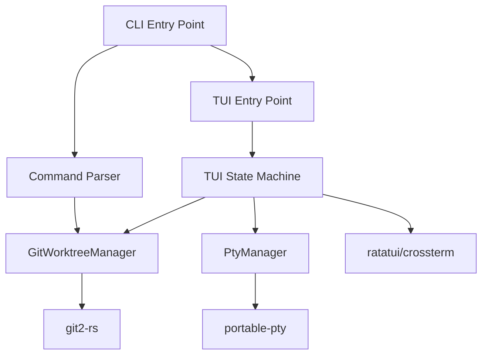
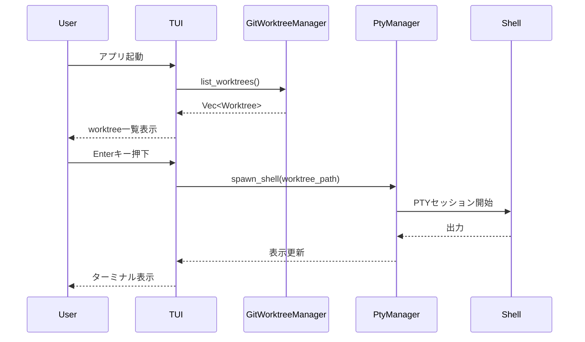
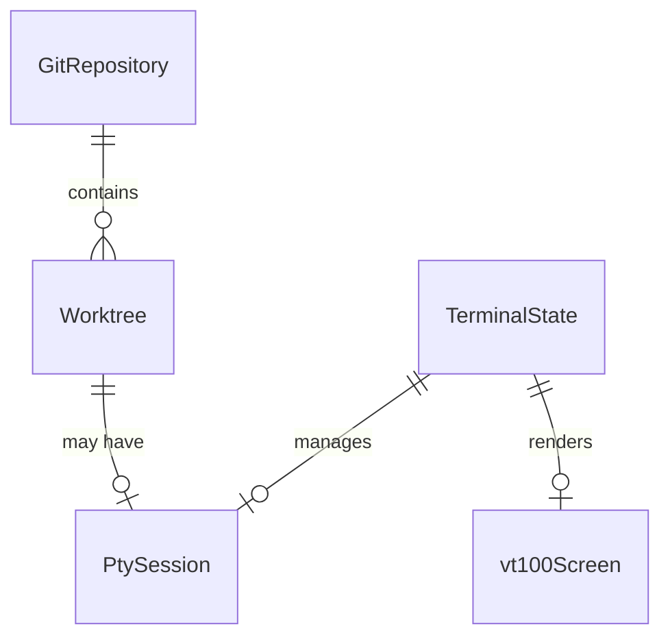

# Technical Design

## 概要

mitos MVPは、Git worktree操作用のCLIコマンドと、worktreeディレクトリで動作するPTYベースのターミナルエミュレータを提供します。`mitos enter <worktree>`でPTYセッションを開始し、VT100エスケープシーケンスをパースして端末出力を描画します。

## 要件マッピング

### 設計コンポーネントのトレーサビリティ
各設計コンポーネントが対応する要件:
- **GitWorktreeManager** → 要件1: Git Worktree管理機能
- **PtyManager** → 要件2: PTYベースターミナルエミュレーション
- **TerminalEmulator** → 要件2,3: PTYターミナルエミュレーション+表示
- **CliApp** → 要件4: CLIインターフェース
- **ErrorHandler** → 要件5: エラー処理とログ

### ユーザーストーリーカバレッジ
- **worktree管理**: GitWorktreeManagerがlist/create/removeを実装
- **シェル起動**: PtyManagerがworktreeディレクトリでのシェル起動を実装
- **ターミナル表示**: TerminalEmulatorがVT100パース・描画を実装
- **コマンドライン操作**: CliAppがスクリプト可能なインターフェースを提供
- **エラー処理**: ErrorHandlerが全レイヤーのエラーを適切に処理

## アーキテクチャ



### 技術スタック

- **言語**: Rust (edition = "2021")
- **Git操作**: git2 v0.18+
- **PTY**: portable-pty v0.8+
- **ターミナル表示**: ratatui v0.26+ + crossterm v0.27+
- **VT100パース**: vt100 v0.15+
- **CLI**: clap v4.5+
- **非同期処理**: tokio v1.40+ (macros, rt-multi-thread, fs, io-util)
- **シリアライゼーション**: serde v1.0+ + serde_json v1.0+
- **エラー処理**: thiserror v1.0+
- **ビルドシステム**: Cargo

### アーキテクチャ決定の根拠

- **なぜRust**: メモリ安全性、クロスプラットフォーム対応、優れたパフォーマンス
- **なぜgit2**: libgit2の実績、worktree APIの完全サポート
- **なぜportable-pty**: Windows ConPTYとUnix PTYの統一インターフェース
- **なぜratatui + crossterm**: ターミナルリサイズ、Unicode幅計算、Raw mode管理を統合提供
- **なぜvt100**: 完全なANSIエスケープシーケンスパース、スクリーン状態管理
- **なぜtokio**: PTYの非同期I/O処理、イベントループ管理に必須
- **なぜserde**: worktree情報の構造化データ処理
- **なぜclap**: デファクトスタンダード、サブコマンドサポート、自動ヘルプ生成

### 動作フロー

1. CLIコマンドで worktree操作（list/create/remove）
2. `mitos enter <worktree>` でPTYセッション開始
3. VT100パーサーがエスケープシーケンスを解釈
4. ターミナルバッファに描画
5. ユーザー入力をPTYに転送

### データフロー

#### メインユーザーフロー: worktreeでシェル起動



## モジュール構成

```
src/
├── main.rs                 // エントリーポイント
├── lib.rs                  // ライブラリルート
├── cli.rs                  // CLIコマンド処理
├── terminal/
│   ├── mod.rs             // ターミナルモジュール
│   ├── emulator.rs        // ターミナルエミュレータ
│   ├── parser.rs          // VT100パーサー
│   └── buffer.rs          // スクリーンバッファ
├── git/
│   ├── mod.rs             // Gitモジュール
│   └── worktree.rs        // worktree管理
├── pty/
│   ├── mod.rs             // PTYモジュール
│   └── session.rs         // PTYセッション管理
└── error.rs               // エラー定義
```

## コンポーネントとインターフェース

### バックエンドサービス

```rust
// src/git/worktree.rs
pub struct GitWorktreeManager {
    repo: git2::Repository,
}

impl GitWorktreeManager {
    pub fn new() -> Result<Self>                              // リポジトリ初期化
    pub fn list_worktrees(&self) -> Result<Vec<Worktree>>    // worktree一覧取得
    pub fn create_worktree(&self, branch: &str) -> Result<()> // worktree作成
    pub fn remove_worktree(&self, path: &Path) -> Result<()>  // worktree削除
    pub fn is_locked(&self, path: &Path) -> bool              // ロック状態確認
}

// src/pty/session.rs
pub struct PtyManager {
    pty: Box<dyn portable_pty::MasterPty>,
}

impl PtyManager {
    pub fn spawn_shell(&mut self, cwd: &Path) -> Result<()>   // シェル起動
    pub fn write(&mut self, data: &[u8]) -> Result<()>         // 入力送信
    pub fn read(&mut self) -> Result<Vec<u8>>                  // 出力読み取り
    pub fn resize(&mut self, size: PtySize) -> Result<()>      // リサイズ
    pub fn close(&mut self) -> Result<()>                       // セッション終了
}
```

### ターミナルエミュレータコンポーネント

```rust
// src/terminal/emulator.rs
pub struct TerminalEmulator {
    parser: vt100::Parser,
    pty_session: PtySession,
    terminal: Terminal<CrosstermBackend<Stdout>>,
}

impl TerminalEmulator {
    pub fn new(worktree_path: &Path) -> Result<Self>     // エミュレータ初期化
    pub fn run(&mut self) -> Result<()>                  // メインループ
    pub fn handle_input(&mut self, key: Key) -> Result<()> // キー入力処理
    pub fn render(&mut self) -> Result<()>               // 画面描画
}

// src/terminal/parser.rs  
pub struct VT100Handler {
    screen: vt100::Screen,
}

impl VT100Handler {
    pub fn process(&mut self, data: &[u8])               // VT100シーケンス処理
    pub fn get_screen(&self) -> &vt100::Screen           // スクリーン状態取得
}
```

### CLIコマンドインターフェース

| コマンド | 用途 | 引数 | 例 |
|---------|------|------|-----|
| mitos list | worktree一覧表示 | なし | `mitos list` |
| mitos create | worktree作成 | branch-name | `mitos create feature-xyz` |
| mitos remove | worktree削除 | worktree-path | `mitos remove ../worktrees/old` |
| mitos enter | PTYセッション起動 | worktree-path | `mitos enter ../worktrees/main` |

## データモデル

### ドメインエンティティ

1. **Worktree**: Git worktreeの情報
2. **PtySession**: アクティブなPTYセッション
3. **TerminalState**: ターミナルエミュレータの状態

### エンティティ関係



### データモデル定義

```rust
// Worktree情報
#[derive(Debug, Clone)]
pub struct Worktree {
    pub path: PathBuf,
    pub branch: String,
    pub head_commit: String,
    pub is_locked: bool,
    pub is_current: bool,
}

// PTYセッション
pub struct PtySession {
    pub worktree_path: PathBuf,
    pub master: Box<dyn portable_pty::MasterPty>,
    pub child: Box<dyn portable_pty::Child>,
    pub reader: Box<dyn std::io::Read + Send>,
    pub writer: Box<dyn std::io::Write + Send>,
}

// ターミナル状態
pub struct TerminalState {
    pub screen: vt100::Screen,
    pub cursor_position: (u16, u16),
    pub scroll_region: (u16, u16),
    pub active_session: Option<PtySession>,
}
```

## エラー処理

```rust
use thiserror::Error;

#[derive(Error, Debug)]
pub enum MitosError {
    #[error("Git操作エラー: {0}")]
    GitError(#[from] git2::Error),
    
    #[error("PTYエラー: {0}")]
    PtyError(String),
    
    #[error("Worktree '{0}' は既に存在します")]
    WorktreeExists(String),
    
    #[error("Worktree '{0}' はロックされています")]
    WorktreeLocked(String),
    
    #[error("ターミナル操作エラー: {0}")]
    TerminalError(#[from] std::io::Error),
    
    #[error("不正な引数: {0}")]
    InvalidArgument(String),
}

// パニック時の端末復元
impl Drop for TerminalEmulator {
    fn drop(&mut self) {
        let _ = terminal::disable_raw_mode();
        let _ = execute!(std::io::stdout(), terminal::LeaveAlternateScreen);
    }
}
```

## パフォーマンスとスケーラビリティ

### パフォーマンス目標

| メトリック | 目標 | 測定対象 |
|-----------|------|----------|
| 起動時間 | < 100ms | アプリ起動からTUI表示まで |
| worktree一覧取得 | < 50ms | git2-rs API呼び出し |
| PTYレスポンス | < 10ms | キー入力から画面更新まで |
| メモリ使用量 | < 50MB | 通常操作時 |

### 最適化戦略
- worktree情報の遅延読み込み
- PTY出力のバッファリングと一括更新
- TUI再描画の最小化（差分更新）

## テスト戦略

### リスクマトリクス

| 領域 | リスク | 必須 | オプション | 参照 |
|-----|--------|-----|-----------|-----|
| Git操作 | 高 | 単体、統合 | - | 要件1 |
| PTY制御 | 高 | 単体、統合 | - | 要件2 |
| ターミナル表示 | 中 | 単体 | 統合 | 要件2,3 |
| CLIコマンド | 低 | 単体 | - | 要件4 |
| エラー処理 | 中 | 単体 | - | 要件5 |

### テスト実装

```rust
#[cfg(test)]
mod tests {
    use super::*;
    
    #[test]
    fn test_list_worktrees() {
        // worktree一覧取得のテスト
    }
    
    #[test]
    fn test_create_worktree() {
        // worktree作成のテスト
    }
    
    #[test]
    fn test_pty_spawn() {
        // PTYセッション起動のテスト
    }
}
```

### CI設定

| ステージ | 実行内容 | ゲート | 時間 |
|---------|---------|--------|------|
| PR | cargo test + cargo clippy | 失敗=ブロック | ≤2分 |
| main | cargo test --all | 失敗=ブロック | ≤3分 |