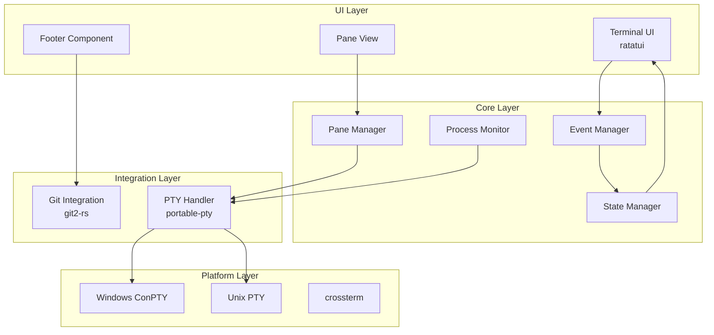
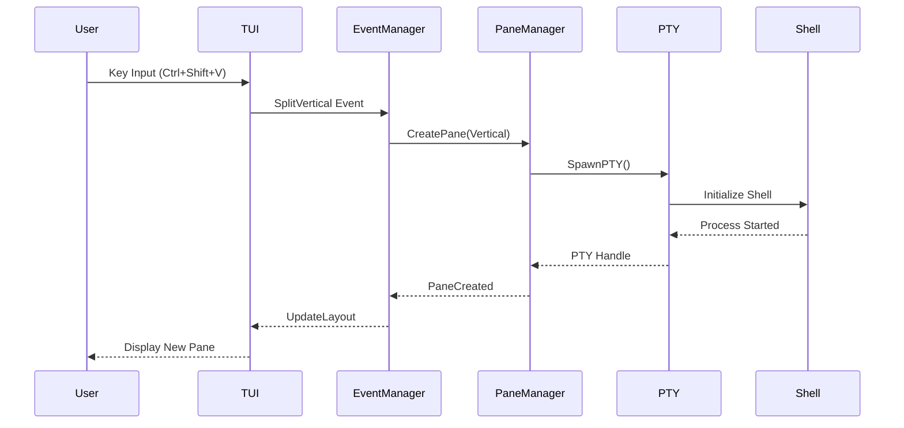
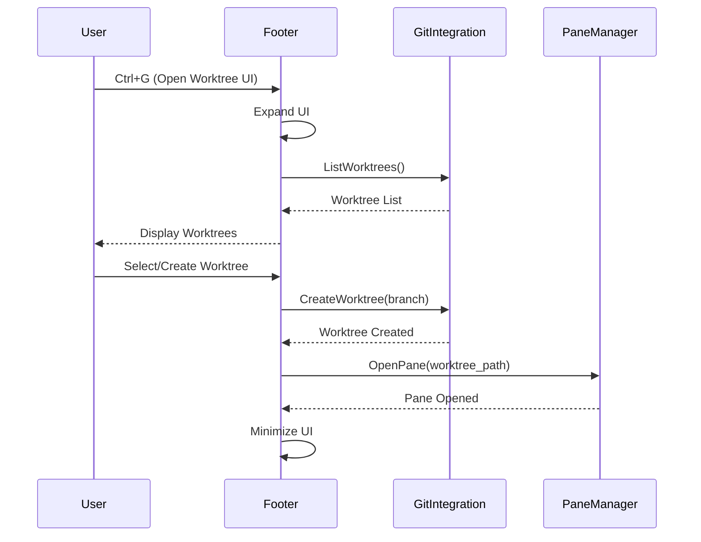
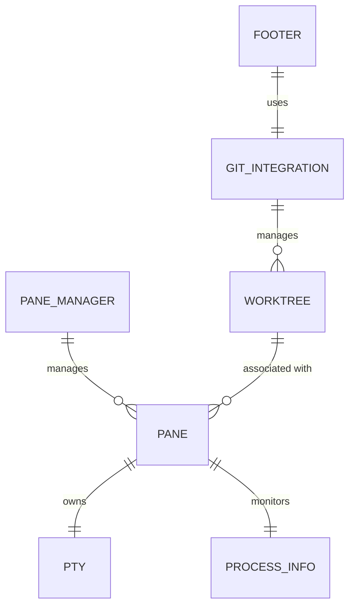

# Technical Design

## 概要

Mitos MVPは、Rustで実装される次世代ターミナルマルチプレクサです。既存のターミナルマルチプレクサの優れた機能を継承しつつ、Git Worktreeとの革新的な統合により、AIエージェント時代の開発ワークフローに最適化された新しい体験を提供します。

本設計は、フッター領域を活用した非侵襲的なWorktree管理UIと、プロセスベースの自動ペインタイトル表示を核心機能として実装します。

## 要件マッピング

### 設計コンポーネントのトレーサビリティ

各設計コンポーネントは特定の要件に対応しています：

- **ペインマネージャー** → Requirement 1: コアターミナルマルチプレクサ機能
- **PTY/ConPTYハンドラー** → Requirement 1.1-1.3: ペイン作成と分割
- **プロセスモニター** → Requirement 2: ペインタイトル管理
- **フッターUIコンポーネント** → Requirement 3: Git Worktree統合
- **Git統合レイヤー** → Requirement 3.4-3.6: Worktree操作
- **プラットフォーム抽象化レイヤー** → Requirement 4: クロスプラットフォーム対応
- **レンダリングエンジン** → Requirement 5: 基本的なパフォーマンス要件

### ユーザーストーリーカバレッジ

1. **複数ターミナルセッション管理**: ペインマネージャーとPTYハンドラーによる効率的な管理
2. **プロセス可視化**: プロセスモニターによる自動タイトル更新
3. **Git Worktree統合**: フッターUIとGit統合レイヤーによるシームレスな操作
4. **クロスプラットフォーム**: プラットフォーム抽象化レイヤーによる統一体験

## アーキテクチャ



### 技術スタック

調査結果と要件分析に基づく選定：

- **UI Framework**: `ratatui` - Zellijでも採用されている実績あるTUIライブラリ
- **Terminal Manipulation**: `crossterm` - Windows/Linux/macOS完全対応
- **PTY Management**: `portable-pty` - ConPTY/PTY統一API
- **Git Integration**: `git2-rs` + システムコマンド - Worktree操作の完全サポート
- **Async Runtime**: `tokio` - 高性能な非同期処理
- **State Management**: `Arc<Mutex>` + `mpsc channels` - 安全な状態共有
- **Config Format**: `TOML` - Rust標準の設定フォーマット

### アーキテクチャ決定の根拠

- **なぜratatui**: 活発なコミュニティ、豊富なウィジェット、Zellijでの実績
- **なぜcrossterm**: 真のクロスプラットフォーム対応、Windows Terminalとの良好な互換性
- **なぜportable-pty**: Windows ConPTYとUnix PTYの抽象化、統一されたAPI
- **なぜtokio**: Rustエコシステムでの標準、優れたパフォーマンス
- **なぜgit2-rs**: libgit2の安定性、Worktree APIの直接サポート

### データフロー



### Git Worktree操作フロー



## コンポーネントとインターフェース

### コアサービスとメソッドシグネチャ

```rust
// ペインマネージャー
pub struct PaneManager {
    panes: HashMap<PaneId, Pane>,
    layout: Layout,
}

impl PaneManager {
    pub fn create_pane(&mut self, split: SplitDirection) -> Result<PaneId>
    pub fn close_pane(&mut self, id: PaneId) -> Result<()>
    pub fn focus_pane(&mut self, id: PaneId) -> Result<()>
    pub fn resize_pane(&mut self, id: PaneId, size: Size) -> Result<()>
    pub fn get_active_pane(&self) -> Option<&Pane>
}

// プロセスモニター
pub struct ProcessMonitor {
    monitors: HashMap<PaneId, ProcessInfo>,
}

impl ProcessMonitor {
    pub fn get_process_name(&self, pane_id: PaneId) -> String
    pub fn update_process_info(&mut self, pane_id: PaneId) -> Result<()>
    pub fn set_custom_title(&mut self, pane_id: PaneId, title: String)
}

// Git統合
pub struct GitIntegration {
    repo: Repository,
}

impl GitIntegration {
    pub fn list_worktrees(&self) -> Result<Vec<Worktree>>
    pub fn create_worktree(&self, branch: &str, path: &Path) -> Result<Worktree>
    pub fn delete_worktree(&self, name: &str) -> Result<()>
    pub fn get_worktree_status(&self, name: &str) -> Result<WorktreeStatus>
}

// フッターコンポーネント
pub struct FooterComponent {
    expanded: bool,
    worktrees: Vec<WorktreeInfo>,
}

impl FooterComponent {
    pub fn toggle_expansion(&mut self) -> Result<()>
    pub fn handle_input(&mut self, key: KeyEvent) -> Result<Action>
    pub fn render(&self, area: Rect, buf: &mut Buffer)
}
```

### UIコンポーネント

| コンポーネント名 | 責任 | 状態の概要 |
|-----------------|------|-----------|
| `PaneView` | ペインコンテンツの表示 | PTY出力バッファ、スクロール位置 |
| `PaneTitle` | プロセス名/カスタムタイトル表示 | プロセス情報、カスタムタイトル |
| `FooterBar` | Worktreeステータス表示（最小化時） | 現在のWorktree、ブランチ名 |
| `FooterExpanded` | Worktree管理UI（展開時） | Worktreeリスト、選択状態 |
| `StatusLine` | システム状態表示 | ペイン数、フォーカス状態 |

## データモデル

### ドメインエンティティ

1. **Pane**: ターミナルペインの表現
2. **Layout**: ペインレイアウトの管理
3. **Worktree**: Git Worktreeの情報
4. **ProcessInfo**: 実行中プロセスの情報
5. **Config**: ユーザー設定

### エンティティ関係



### データモデル定義

```rust
// ペイン
#[derive(Debug, Clone)]
pub struct Pane {
    pub id: PaneId,
    pub pty: Arc<Mutex<PtyHandle>>,
    pub title: PaneTitle,
    pub size: Size,
    pub position: Position,
    pub worktree: Option<String>,
    pub created_at: DateTime<Utc>,
}

// ペインタイトル
#[derive(Debug, Clone)]
pub enum PaneTitle {
    Process(String),      // 自動検出されたプロセス名
    Custom(String),       // ユーザー設定のタイトル
    Directory(PathBuf),   // デフォルト（ディレクトリ名）
}

// レイアウト
#[derive(Debug, Clone)]
pub enum Layout {
    Single(PaneId),
    HSplit(Box<Layout>, Box<Layout>, f32), // 水平分割、比率
    VSplit(Box<Layout>, Box<Layout>, f32), // 垂直分割、比率
}

// Worktree情報
#[derive(Debug, Clone)]
pub struct WorktreeInfo {
    pub name: String,
    pub path: PathBuf,
    pub branch: String,
    pub active_panes: Vec<PaneId>,
    pub is_current: bool,
}

// プロセス情報
#[derive(Debug, Clone)]
pub struct ProcessInfo {
    pub pid: u32,
    pub name: String,
    pub cmdline: Vec<String>,
    pub cwd: PathBuf,
    pub updated_at: DateTime<Utc>,
}

// 設定
#[derive(Debug, Deserialize, Serialize)]
pub struct Config {
    pub keybindings: HashMap<String, Action>,
    pub theme: Theme,
    pub shell: PathBuf,
    pub default_cwd: Option<PathBuf>,
    pub min_pane_size: Size,
}
```

## エラーハンドリング

```rust
#[derive(Debug, thiserror::Error)]
pub enum MitosError {
    #[error("PTY creation failed: {0}")]
    PtyError(#[from] portable_pty::Error),
    
    #[error("Git operation failed: {0}")]
    GitError(#[from] git2::Error),
    
    #[error("Pane {0} not found")]
    PaneNotFound(PaneId),
    
    #[error("Invalid layout: {0}")]
    InvalidLayout(String),
    
    #[error("Platform not supported: {0}")]
    UnsupportedPlatform(String),
    
    #[error("IO error: {0}")]
    IoError(#[from] std::io::Error),
}

pub type Result<T> = std::result::Result<T, MitosError>;
```

## パフォーマンスとスケーラビリティ

### パフォーマンス目標

| メトリクス | 目標 | 測定対象 |
|-----------|------|---------|
| キー入力レイテンシ | < 50ms | 入力から画面反映まで |
| レンダリングFPS | > 30fps | 通常使用時 |
| ペイン切り替え | < 10ms | フォーカス変更 |
| Worktree UI表示 | < 100ms | Ctrl+G押下から表示 |
| メモリ使用量/ペイン | < 10MB | アイドル状態 |

### 最適化戦略

- **差分レンダリング**: 変更された領域のみ再描画
- **PTY出力バッファリング**: 大量出力時のバッチ処理
- **非同期I/O**: tokioによる並行処理
- **遅延読み込み**: Worktree情報のキャッシュと遅延更新

## テスト戦略

### リスクマトリクス

| エリア | リスク | 必須 | オプション | 参照 |
|--------|--------|------|-----------|------|
| PTY/ConPTY統合 | H | Unit, Integration | Load | 1.1-1.3 |
| プロセス監視 | M | Unit, Integration | - | 2.1-2.3 |
| Git Worktree操作 | H | Unit, Integration, E2E | - | 3.1-3.6 |
| クロスプラットフォーム | H | Integration (各OS) | - | 4.1-4.3 |
| レンダリング性能 | M | Unit, Performance | Stress | 5.1-5.4 |

### レイヤー別最小テスト

- **Unit**: コア機能の境界値テスト（ペイン分割、プロセス検出）
- **Integration**: PTY/Git統合、プラットフォーム固有機能
- **E2E**: 主要ユーザーフロー（ペイン作成、Worktree切り替え）
- **Performance**: レンダリング速度、メモリ使用量

### CI ゲート

| ステージ | 実行内容 | 失敗時 | SLA |
|---------|---------|--------|-----|
| PR | Unit + Clippy + Format | ブロック | < 3分 |
| Main | Integration (Linux/Windows/macOS) | ブロック | < 10分 |
| Nightly | Performance + Memory leak | Issue作成 | - |